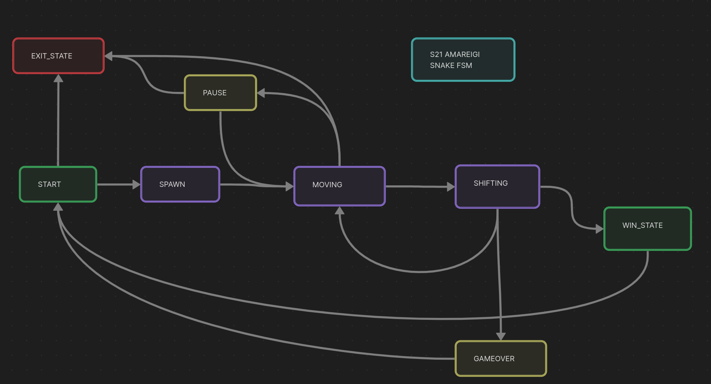

# snake-tetris-gui-c-cpp

В данном проекте реализована игра «Змейка» на языке программирования С++ с добавлением игры «Тетрис» написанной на C.

## Введение

Проект состоит из отдельных компонентов: библиотек Змейки и Тетриса , отвечающих за реализацию логики игры, и десктопного графического интерфейса, а так же консольного интерфейса.

## Chapter I 
## Общая информация

Для формализации логики игры использованы конечные автоматы.

### Змейка

Игрок управляет змейкой, которая непрерывно движется вперед. Игрок изменяет направление движения змейки с помощью стрелок. Цель игры заключается в сборе «яблок» появляющихся на игровом поле. При этом игрок не должен касаться стенок игрового поля. После «поедания» очередного «яблока» длина змейки увеличивается на один. Игрок побеждает, если змейка достигает максимального размера (200 «пикселей»). Если змейка сталкивается с границей игрового поля, то игрок проигрывает.

### Тетрис

Цель игры — в наборе очков за построение линий из генерируемых игрой блоков. Очередной блок, сгенерированный игрой, начинает опускаться вниз по игровому полю, пока не достигнет нижней границы или не столкнется с другим блоком. Пользовать может поворачивать фигуры и перемещать их по горизонтали, стараясь составлять ряды. После заполнения ряд уничтожается, игрок получает очки, а блоки, находящиеся выше заполненного ряда опускаются вниз. Игра заканчивается, когда очередная фигура останавливается в самом верхнем ряду.

### Использованные паттерны

Паттерн MVC (Model-View-Controller, Модель-Представление-Контроллер) представляет из себя схему разделения модулей приложения на три отдельных макрокомпонента: модель, содержащую в себе бизнес-логику, представление — форму пользовательского интерфейса для осуществления взаимодействия с программой и контроллер, осуществляющий модификацию модели по действию пользователя.

## Техническая реализация

- Программа разработана на языке C++ стандарта C++17.
- Код библиотеки программы находится в папке src/brick_game/snake.
- Код с интерфейсом программы должен находится в папке src/gui/desktop.
- При написании кода придерживался Google Style.
- Библиотека, реализующая логику игры покрыта unit-тестам. Для тестов использована библиотеку GTest. Покрытие библиотеки тестами составляет больше 90 процентов.
- Сборка программы настроена с помощью Makefile со стандартным набором целей для GNU-программ: all, install, uninstall, clean, dvi, dist, tests.
- Графический интерфейс, на базе Qt 5
- В игре змейка присутствуют следующие механики:
  - Змейка передвигается по полю самостоятельно, на один блок вперед по истечении игрового таймера.
  - Когда змейка сталкивается с «яблоком», ее длина увеличивается на один.
  - Когда длина змейки достигает 200 единиц, игра заканчивается победой игрока.
  - Когда змейка сталкивается с границей поля или сама с собой, игра заканчивается поражением игрока.
  - Пользователь может менять направление движение змейки с помощью стрелок, при этом змейка может поворачивать только налево и направо относительно текущего направления движения.
  - Пользователь может ускорять движение змейки зажатием клавиши действие.
- Начальная длина змейки равна четырем «пикселям».
- Игровое поле имеет размер 10 «пикселей» в ширину и 20 «пикселей» в высоту.

## Конечный автомат игры змейка

